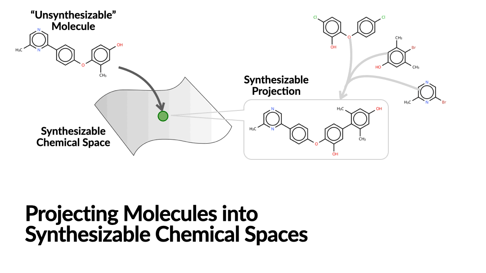

# ChemProjector



:dart: Projecting Molecules into Synthesizable Chemical Spaces (ICML 2024)

[[Paper]](https://arxiv.org/abs/2406.04628)


## ⚠️ Update

**ChemProjector and its derivatives (e.g. SynFormer) have been deprecated**. Please refer to our latest model **PrexSyn**: Efficient and Programmable Exploration of Synthesizable Chemical Space:
- **Code**: https://github.com/luost26/PrexSyn
- **Paper**: https://arxiv.org/abs/2512.00384
- **Documentation**: https://prexsyn.readthedocs.io/


## Install

### Clone Repo

Please clone the repository with the `--recurse-submodules` flag to *include the third-party submodules*.

```bash
git clone --recurse-submodules https://github.com/luost26/ChemProjector.git
```

### Environment

```bash
# Install conda environment
conda env create -f env.yml -n chemprojector
conda activate chemprojector

# Install ChemProjector package
pip install -e .
```

The default CUDA version is 11.8. If you have to use a different version, please modify the `env.yml` file accordingly.


### Building Block Data

We provide preprocessed building block data. You can download it from [here](https://drive.google.com/file/d/1scui0RZ8oeroDAafnw4jgTi3yKtXxXpe/view?usp=drive_link) and put it in the `data` directory.

However, the data is derived from Enamine's building block catalog, which are **available only upon request**.
Therefore, you should first request the data from Enamine [here](https://enamine.net/building-blocks/building-blocks-catalog) and download the <ins>US Stock</ins> catalog into the `data` directory.
Then run the following script which will check whether you have a copy of the Enamine's catalog and unarchive the preprocessed data for you:
```bash
python unarchive_wizard.py
```

You may also process the building block data by yourself. Please refer to the `scripts/preprocess_data` directory for more details.


### Trained Weights

You can download the trained weights from [here](https://drive.google.com/drive/folders/1T9f9MsEAsAjPV8GR0pXimHKCvq97SIzs?usp=drive_link) and put them in the `data/trained_weights` directory.


### Summary of Downloads

| Item                                                         | Link                                                         | Destination                                                  |
| ------------------------------------------------------------ | ------------------------------------------------------------ | ------------------------------------------------------------ |
| Preprocessed building blocks and reaction templates (password protected) | https://drive.google.com/file/d/1scui0RZ8oeroDAafnw4jgTi3yKtXxXpe/view?usp=drive_link | `data/processed.zip`                                         |
| Enamine building block US stock catalog (to unzip the password protected preprocessed files) | https://enamine.net/building-blocks/building-blocks-catalog  | `data/Enamine_*.sdf`                                    |
| Trained weights                                              | https://drive.google.com/drive/folders/1T9f9MsEAsAjPV8GR0pXimHKCvq97SIzs?usp=drive_link | `data/trained_weights/original_default.ckpt`, `data/trained_weights/original_split.ckpt` |


## Usage

### Project Molecules

You can create a list of SMILES strings in CSV format (example: `data/example.csv`) and run the following command to project them into the synthesizable chemical space.
```bash
python sample.py \
    --model-path data/trained_weights/original_default.ckpt \
    --input data/example.csv \
    --output results/example.csv
```

### Model Evaluation

#### Bottom-Up Synthesis Planning (Chemical Space Projection)

| Test set     | Command                                      |
| ------------ | -------------------------------------------- |
| Test split   | `./scripts/synthesis_planning_test_split.sh` |
| ChEMBL       | `./scripts/synthesis_planning_chembl.sh`     |
| Enamine REAL | `./scripts/synthesis_planning_enamine.sh`    |


#### Structure-Based Drug Design

Please refer to the `scripts/sbdd` directory for details.

#### Goal-Directed Generation

Please refer to the `scripts/goal_directed` directory for details.

### Train

```bash
python train.py ./configs/original_default.yml
```

## Reference

```bibtex
@inproceedings{luo2024chemprojector,
  title={Projecting Molecules into Synthesizable Chemical Spaces},
  author={Shitong Luo and Wenhao Gao and Zuofan Wu and Jian Peng and Connor W. Coley and Jianzhu Ma},
  booktitle={Forty-first International Conference on Machine Learning},
  year={2024}
}
```
